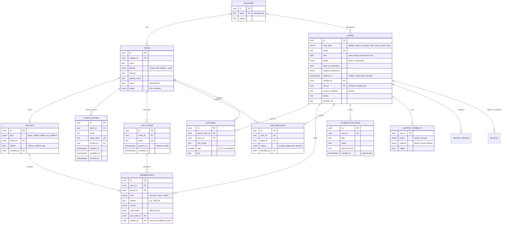
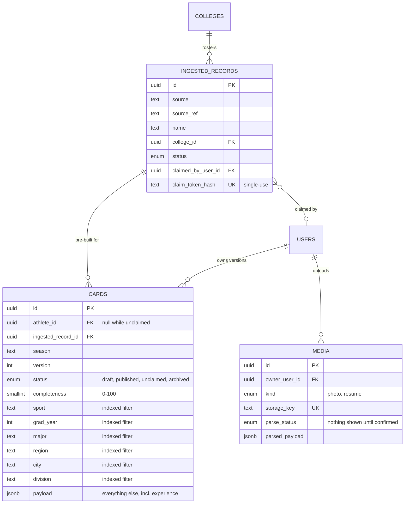
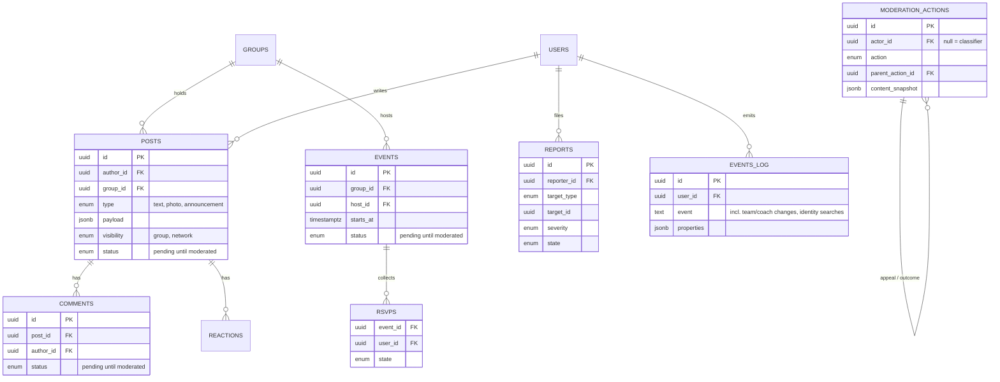
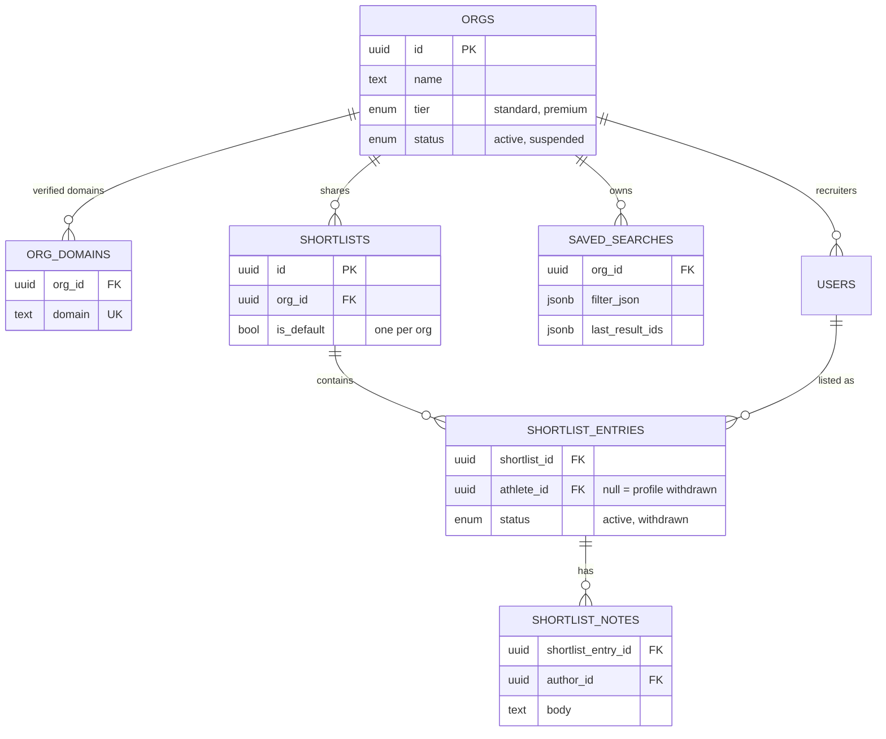

# Data model

The schema TI-14 implements: the TI-4 v2 model (PRD v2, see the TI-4 v2 validation doc) plus PRD
v2.1 team onboarding (TI-148/TI-149). **30 tables.** Source of truth is
`apps/api/src/db/schema/`; this page explains it. If you change the schema, update the diagrams here.

## How the count gets to 30

| Step                                                                                                 | Tables |
| ---------------------------------------------------------------------------------------------------- | ------ |
| Original TI-4 model                                                                                  | 23     |
| + `device_tokens`, `shortlist_notes` (first TI-4 pass)                                               | 25     |
| + `children`, `join_codes`, `join_requests`, `blocks`, `org_domains`, `contact_visibility` (TI-4 v2) | 31     |
| − `seats`, `contact_requests` (gone in PRD v2)                                                       | 29     |
| + `coach_invites` (PRD v2.1); `schools` renamed `colleges`                                           | **30** |

Identity-search auditing is an `events_log` event (`search.identity_filter`), not its own table.

## Rules the schema enforces

- **No health data, no minor flag.** No column stores a condition, diagnosis, injury or `is_minor`.
  Minor status is derived from `users.dob`. `schema-rules.test.ts` fails on any such column name.
- **Children never log in and have no birthdate.** They are rows in `children` (age only, checked
  0–12), owned by a parent user, never rows in `users`.
- **Consent is history, not a boolean.** `consent_records` is append-only; a flag's current value is
  its newest row.
- **Seasons.** `memberships.season` and `cards.season` let roster dedupe (TI-36) resolve one athlete
  across years. Cards are versioned (`season`, `version`).
- **Moderation first.** `posts`, `comments` and `events` default to `status = pending`.
- **Every foreign key has an index**; the users soft-delete (`deleted_at`) has a partial index for the
  30-day erasure job. Both are checked by `schema-rules.test.ts`.
- **Deletion.** Setting `users.deleted_at` hides an account at once; a scheduled job hard-deletes it
  with cascade after 30 days (TI-79). Foreign keys cascade for things a person owns and `set null`
  for records that outlive them (who invited, who decided, shortlist entries → "profile withdrawn").

Rules that live in the access layer, not the schema: child and teen profiles never appear in search,
recruiter views, card exports or the network feed; teens never see athletes' contacts;
`open_to_recruiting` requires a published card; only official affinity groups with a member's
`searchable` opt-in can be a recruiter filter, behind the feature flag.

## Identity, teams and groups

## Cards, media and alumni

## Community and safety

## Employer side

## Decisions beyond the TI-4 doc

Small calls made while implementing, flagged for review:

- `schools` → `colleges` everywhere (`users.college_id`, `groups.college_id`,
  `ingested_records.college_id`, group kind `college`), per PRD v2.1.
- `users` gains `first_name`, `last_name` (signup collects them) and `open_to_recruiting`.
- `groups` gains `org_id` (for `kind = org`) and `created_by` (user-created affinity groups).
- `events` gains `status`, since events go through moderation too.
- `join_codes` gains `code`, the value the QR encodes.
- `cards` gains `ingested_record_id`, and `athlete_id` is nullable, so an alumni card can exist
  before it is claimed.
- `ingested_records.claim_proof` is `claim_token_hash`: the hash of the single-use claim token.
- Enum values TI-4 left open (group visibility, membership role/source, org tier, reaction kinds,
  report severity) are first guesses; change them in `schema/enums.ts`.
